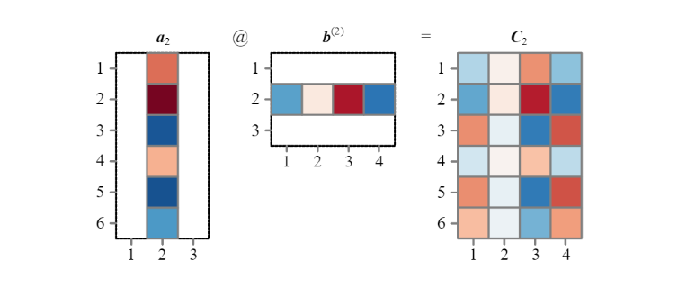
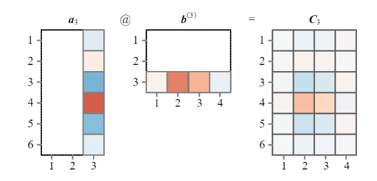

# <center>Chapter_02</center>

```python
# 各种需要用到的函数

"""

input()                    函数接受一个标准输入数据，返回为字符串str类型
int()                      将输入转化为整数
math.factorial()           计算阶乘
numpy.cumprod()            计算累积乘积
numpy.inner()              计算行向量的内积，函数输入为连个列向量时得到的结果为张量积
numpy.linalg.inv()         计算方阵的逆
numpy.linspace()           在指定的间隔内，返回固定步长的数组
numpy.math.factorial()     计算阶乘
numpy.random.seed()        固定随机数发生器种子
numpy.random.uniform()     产生满足连续均匀分布的随机数
numpy.sum()                求和
scipy.special.factorial()  计算阶乘
seaborn.heatmap()          绘制热图

"""

```

## 2.1 算数乘除：先乘除，后加减，括号内先算
### 2.1.1 乘法
**乘法**算式等号左端是**被乘数**和**乘数**，右端是**乘积**。
几个常用的乘法符号：
- ${\times}$用于数字相乘，一般不用于变量相乘。
    - 在线性代数中${\times}$表示**叉乘**
- 两变量a,b相乘可以写成${ab}$，这种记法被称为**隐含乘法**，${ab}$也可写为${a \cdot b}$  
乘法运算时要注意单位。有一些数值本身**无单位**，比如个数，z分数（**标准分数**）。


```python
# 计算两个数的乘法

num1 = 2
num2 = 3

# num1 times num2 equals prod
prod = num1*num2

# display the computation
print('The product of {0} and {1} is {2}'.format(num1, num2, prod))
```

    The product of 2 and 3 is 6
    

### 2.1.2 阶乘
某个正整数的**阶乘**是所有小于等于该数的正整数的积。例如5的阶乘记为${5!}$：  
$${5!=5 \times 4 \times 3 \times 2 \times 1}$$
**特别的，0!=1**


```python
# 计算一个整数的阶乘
number = int(input("Please enter a integer: "))
factorial = 1

if number < 0:
    print("The integer should be positive.")
elif number == 0:
    print("The integer of 0 is 1")
else:
    for i in range(1, number + 1):
        factorial *= i
    print("The factorial of {0} is {1}".format(number, factorial))
```

    Please enter a integer:  5
    

    The factorial of 5 is 120
    

### 2.1.3 累计乘积
对于一组数字，**累计乘积**也叫**累积乘积**，类似于累计求和，，它得到的结果不仅仅是一个乘积，二十从左向右每乘一个数值得到的分步结果。比如，自然数1到10的累计求积结果为：
$${1, 2, 6, 24, 120, 720, 5040, 40320, 362880, 3628800}$$  


```python
# 计算一组数的累积乘积

import numpy as np

ten_num = np.linspace(1, 10, 10)
print(ten_num)

products = np.cumprod(ten_num)
np.set_printoptions(suppress=True)  # 禁用科学计数法
print(products)

"""使用numpy.arange()生成1-10"""
ten_num = np.arange(1, 11)
print(ten_num)
```

    [ 1.  2.  3.  4.  5.  6.  7.  8.  9. 10.]
    [      1.       2.       6.      24.     120.     720.    5040.   40320.
      362880. 3628800.]
    [ 1  2  3  4  5  6  7  8  9 10]
    

### 2.1.4 除法
**除法**是**乘法的逆运算**。**被除数除以除数得到商**。  
除法运算有时候可以**除尽**；有时候会得到**余数**，例如7除2余1。  
除法的结果一般用分数或小数来表达。


```python
# 两个数的除法

num1 = 6
num2 = 3

# num1 divided by num2 equals division
division = num1/num2

# display the computation
print('The division of {0} over {1} is {2}'.format(num1, num2, division))
```

    The division of 6 over 3 is 2.0
    


```python
# 两个数除法（取余）

num1 = 7
num2 = 2

# 'remainder' is the remainder of num1 divided by num2
remainder = num1%num2

# display the computation
print('The remainder of {0} over {1} is {2}'.format(num1, num2, remainder))
```

    The remainder of 7 over 2 is 1
    

### 2.1.5 分数
最常见的分数是**普通分数**，由**分母**和**分子**组成，分隔二者的是**分数线**或正斜杠${/}$。  
非零整数a的**倒数**是$\frac{1}{a}$，分数$\frac{b}{a}$的倒数是$\frac{a}{b}$。

### 2.1.6 英文对照
|数学表达|英文表达|
|:---:|:---|
|${2 \times b =6}$|Two times three equals six<br>Two multiplied by three equals six.<br>Two cross three equals six.<br>The product of two and three is six.<br>If you multiply two by three, you get six.|
|${a \cdot b=c}$|*a* times *b* equals *c*.<br>*a* multiplied by *b* equals *c*.<br>*a* dot *b* equals *c*.<br>The product of *a* and *b* is *c*.|
|${6 \div 3=2}$|Six divided by three equals two.<br>If you divide six by three, you get two.|
|${7 \div 2=3 R 1}$|Seven over two is three and remainder is one.<br>Seven divided by two equals three with a remainder of one.<br>Seven divided by two equals three and the remainder is one.|
|$\frac{1}{2}$, ${1/2}$|One half<br>A half<br>One over two|
|${1:2}$|One to two|
|$-\frac{3}{2}$|Minus three-halves<br>Negative three-halves|
|$\frac{1}{3}$, ${1/3}$|One over three<br>One third|
|$\frac{1}{4}$, ${1/4}$|One over four<br>One fourth<br>One quater<br>One divided by four|
|${1}\frac{1}{4}$|One and one fourth|
|$\frac{3}{5}$|Three fifths|
|$\frac{1}{n}$|One over n|
|$\frac{a}{b}$|a over b<br>a divided by b<br>The ratio of a to b<br>The numerator is *a* while the denominator is *b*.|  
<center>表1. 数学英文对照表</center>

|英文名词|汉语名词|
|:---|:---|
|**multiplication**|乘法|
|**multiplicand**|被乘数|
|**multiplier**|乘数|
|**product**|乘积|
|**times, multiplied by**|乘|
|**multiplication table, times table**|乘法表|
|**cross product, vector product**|叉乘|
|**implied multiplication**|隐含乘法|
|**decimal point**|小数点|
|**scalar product**|标量积|
|**unitless**|无单位|
|**standard score**|标准分数|
|**fractorial**|阶乘|
|**cumulative product**|累计乘积|
|**division**|除法|
|**dividend**|被除数|
|**over, divided by**|除以|
|**divisor, denominator**|除数|
|**quotient**|商|
|**divisible**|除尽|
|**remainder**|余数|
|**fraction**|分数|
|**decimal**|小数|
|**denominator**|分母|
|**numerator**|分子|
|**fraction bar**|分数线|
|**reciprocal**|倒数|  
<center>表2. 中英文对照表</center>

## 2.2 向量乘法：标量乘法、向量内积、逐项积
### 2.2.1 标量乘法
标量乘法中，标量乘向量结果还是向量，相当于缩放。
标量乘法的运算规则为：向量***a***的每一个元素均与k相乘，比如，标量2乘行向量${\begin{bmatrix}1, 2,3\end{bmatrix}}$:
$${2 \times \begin{bmatrix}1 & 2 & 3\end{bmatrix} = \begin{bmatrix}2 \times 1 & 2 \times 2 & 2 \times 3 &\end{bmatrix} = \begin{bmatrix}2 & 4 & 6\end{bmatrix}}$$  
再如，标量乘列向量：
$${2 \times \begin{bmatrix}1 \\ 2 \\ 3\end{bmatrix} = \begin{bmatrix}2 \times 1 \\ 2 \times 2 \\ 2 \times 3\end{bmatrix} = \begin{bmatrix}2 \\ 4 \\ 6\end{bmatrix}}$$ 
同理，标量k乘矩阵***A***结果是k与矩阵A每一个元素相乘，比如：
$${2 \times \begin{bmatrix}1 & 2 & 3 \\ 4 & 5 & 6\end{bmatrix}_{2 \times 3} = \begin{bmatrix}2 \times 1 & 2 \times 2 & 2 \times 3 \\ 2 \times 4 & 2 \times 5 & 2 \times 6\end{bmatrix}_{2 \times 3} = \begin{bmatrix}2 & 4 & 6 \\ 8 & 10 & 12\end{bmatrix}_{2 \times 3}}$$  


```python
# 向量和矩阵的标量乘法

import numpy as np

row_v = np.array([[1, 2, 3]])
col_v = np.array([[1], [2], [3]])

a = 5
print(a * row_v)
print(a * col_v)
```

    [[ 5 10 15]]
    [[ 5]
     [10]
     [15]]
    

### 2.2.2 向量内积
**向量内积**的结果为**标量**。  
向量内积又叫标量积或点积。  
向量内积的运算规则是，两个**形状形同的向量**，对应位置元素一一相乘，再求和。  
例如计算两个行向量内积与列向量内积：
$${\begin{bmatrix}1 & 2 & 3\end{bmatrix} \cdot \begin{bmatrix}4 & 3 & 2\end{bmatrix} = 1 \times 4+2 \times 3+3 \times 2=4+6+6=16}$$  
$${\begin{bmatrix}1 \\ 2 \\ 3\end{bmatrix} \cdot \begin{bmatrix}4 \\ 3 \\ 2\end{bmatrix} = 1 \times 4+2 \times 3+3 \times 2=4+6+6=16}$$  

性质：
1. 交换律
    - ${a \cdot b = b \cdot a}$
2. 分配律
    - ${a \cdot (b+c)=a \cdot b+a \cdot c}$  

用途：
1. 对向量中的元素求和
    $${\begin{bmatrix}a & b & c & d & e\end{bmatrix}^{T} \cdot \begin{bmatrix}1 & 1 & 1 & 1 & 1\end{bmatrix}^{T}=1 \times a+1 \times b+1 \times c+1 \times d+1 \times e}$$  
2. 求向量中元素平均值
    $${\begin{bmatrix}a & b & c & d & e\end{bmatrix}^{T} \cdot \begin{bmatrix}\frac{1}{5} & \frac{1}{5} & \frac{1}{5} & \frac{1}{5} & \frac{1}{5}\end{bmatrix}^{T}=\frac{1}{5} \times a+\frac{1}{5} \times b+\frac{1}{5} \times c+\frac{1}{5} \times d+\frac{1}{5} \times e = \frac{a+b+c+d+e}{5}}$$  
3. 计算向量中元素平方和
     $${\begin{bmatrix}a & b & c & d & e\end{bmatrix}^{T} \cdot \begin{bmatrix}a & b & c & d & e\end{bmatrix}^{T}= {a}^{2}+{b}^{2}+{c}^{2}+{d}^{2}+{e}^{2}}$$  


```python
# 向量内积

import numpy as np

row_v_1 = np.array([[1, 2, 3, 4, 5]])
row_v_2 = np.array([[5, 4, 6, 8, 3]])

col_v_1 = np.array([[1], [2], [3], [4], [5]])
col_v_2 = np.array([[5], [4], [6], [8], [3]])

prod_row = np.inner(row_v_1, row_v_2)
prod_col = np.inner(col_v_1, col_v_2)  # 张量积

print(prod_row)
print(prod_col)
```

    [[78]]
    [[ 5  4  6  8  3]
     [10  8 12 16  6]
     [15 12 18 24  9]
     [20 16 24 32 12]
     [25 20 30 40 15]]
    

### 2.2.3 逐项积
**逐项积**也称**阿达码乘积**，两个形状相同向量的逐项积为对应位置元素分别相乘，结果为相同形状的向量。  
逐项积的运算符为${\odot}$。逐项积相当于算术乘法的批量运算。  
例如，两个行向量逐项积：
$${\begin{bmatrix}1 & 2 & 3\end{bmatrix} \odot \begin{bmatrix}4 & 5 & 6\end{bmatrix}=\begin{bmatrix}1 \times 4 & 2 \times 5 & 3 \times 6\end{bmatrix} = \begin{bmatrix}4 & 10 & 18\end{bmatrix}}$$  
当矩阵形状相同时，两个矩阵逐项积运算为对应元素相乘，形状不变：
$${\begin{bmatrix}1 & 2 & 3 \\ 4 & 5 & 6\end{bmatrix}_{2 \times 3} \odot \begin{bmatrix}1 & 2 & 3 \\ -1 & 0 & 1\end{bmatrix}_{2 \times 3} = \begin{bmatrix}1 \times 1 & 2 \times 2 & 3 \times 3 \\ 4 \times (-1) & 5 \times 0 & 6 \times 1\end{bmatrix}_{2 \times 3}=\begin{bmatrix}1 & 4 & 9 \\ -4 & 0 & 6\end{bmatrix}_{2 \times 3}}$$


```python
# 逐项积

import numpy as np

row_v_1 = np.array([[1, 2, 3, 4, 5]])
row_v_2 = np.array([[5, 4, 6, 8, 3]])

array_1 = np.array([[1, 2, 3], [4, 5, 6], [7, 8, 9]])
array_2 = np.array([[6, 2, 8], [3, 5, 4], [5, 8, 7]])

prod_row = row_v_1 * row_v_2  # 在numpy中，*表示阿达码乘积
prod_array = array_1 * array_2

print(prod_row)
print(prod_array)
```

    [[ 5  8 18 32 15]]
    [[ 6  4 24]
     [12 25 24]
     [35 64 63]]
    

### 2.2.4 英文对照
|英文名词|汉语名词|
|:---|:---|
|**scalar multiplication**|标量乘法|
|**inner product**|向量内积|
|**scalar product**|标量积|
|**dot product**|点积|
|**tensor product**|张量积|
|**piecewise product**|逐项积|
|**Hadamard product**|阿达码乘积|
<center>表3. 中英文对照表</center>

## 2.3 矩阵乘法：最重要的线性代数运算规则
### 2.3.1 矩阵乘法规则
${A}$和${B}$两个矩阵相乘的前提是**矩阵${A}$的列数和矩阵${B}$的行数相同**。  
${A}$和${B}$的乘积一般写作${AB}$。  
在Numpy中，两个矩阵相乘的运算符为@，${AB}$也记作${A@B}$：
$${{C}_{m \times n}={A}_{m \times p}{B}_{p \times n}={A}_{m \times p}@{B}_{p \times n}}$$  
矩阵乘法不满足交换律，即通常情况下：
$${{A}_{m \times p}{B}_{p \times n} \neq {B}_{p \times n}{A}_{m \times p}}$$

### 2.3.2 两个${2 \times 2}$矩阵相乘
下式中，矩阵${A}$和${B}$相乘结果为矩阵${C}$：
$${{C}={AB}=\begin{bmatrix}1 & 2 \\ 3 & 4\end{bmatrix}\begin{bmatrix}4 & 2 \\ 3 & 1\end{bmatrix}=\begin{bmatrix}1 & 2 \\ 3 & 4\end{bmatrix}@\begin{bmatrix}4 & 2 \\ 3 & 1\end{bmatrix}}$$  
矩阵${A}$的第一行元素和矩阵${B}$第一列对应元素进行相乘，再相加，结果得到矩阵${C}$的第一行、第一列元素${{c}_{1,1}}$。  
矩阵${A}$的第一行元素和矩阵${B}$第二列对应元素进行相乘，再相加，结果得到矩阵${C}$的第一行、第一列元素${{c}_{1,2}}$。
${\cdots}$  
总体来说，${A}$和${B}$的乘积${C}$第i行第j列元素${{c}_{i,j}}$等于矩阵${A}$的第i行的元素与矩阵${B}$第j列对应元素乘积再求和。  

  
<center>图1.矩阵乘法规则，两个${2 \times 2}$矩阵相乘为例</center>


```python
# 矩阵乘法

import numpy as np

array_1 = np.array([[1, 2, 5], [6, 4, 7], [3, 8, 9]])
array_2 = np.array([[4, 5, 7], [9, 8, 3], [1, 5, 6]])

prod_array = array_1 @ array_2
print(prod_array)
```

    [[ 27  46  43]
     [ 67  97  96]
     [ 93 124  99]]
    

### 2.3.3 矩阵乘法形态
图2中列出了常见的矩阵乘法形态，每种形态对应一类线性代数问题。  

<center>图2.矩阵乘法形态多样性</center>

### 2.3.4 两个向量相乘
1. 向量${a}$和${b}$为等长列向量，${a}$转置(${a}^{T}$)乘${b}$为标量，等价于${a}$和${b}$的标量积：
$${{a}^{T}b={a \cdot b}}$$  
例如：
$${{a}^{T}b=\begin{bmatrix}1 \\ 2 \\ 3\end{bmatrix}^{T}_{3 \times 1}@\begin{bmatrix}4 \\ 3 \\ 2\end{bmatrix}_{3 \times 1}=\begin{bmatrix}1 & 2 & 3\end{bmatrix}_{1 \times 3}@\begin{bmatrix}4 \\ 3 \\ 2\end{bmatrix}_{3 \times 1}=\begin{bmatrix}1 & 2 & 3\end{bmatrix} \cdot \begin{bmatrix}4 & 3 & 2\end{bmatrix}=16}$$  

2. 列向量${a}$乘${b}$转置(${b}^{T}$)，乘积结果${ab^{T}}$为矩阵：
$${{a}b^{T}=\begin{bmatrix}1 \\ 2 \\ 3\end{bmatrix}_{3 \times 1}@\begin{bmatrix}4 \\ 3 \\ 2\end{bmatrix}^{T}_{3 \times 1}=\begin{bmatrix}1 \\ 2 \\ 3\end{bmatrix}_{3 \times 1}@\begin{bmatrix}4 & 3 & 2\end{bmatrix}_{1 \times 3}=\begin{bmatrix}4 & 3 & 2 \\ 8 & 6 & 4 \\ 12 & 9 & 6\end{bmatrix}}$$  
$${{a}b^{T}=\begin{bmatrix}1 \\ 2\end{bmatrix}_{2 \times 1}@\begin{bmatrix}4 \\ 3 \\ 2\end{bmatrix}^{T}_{3 \times 1}=\begin{bmatrix}1 \\ 2\end{bmatrix}_{2 \times 1}@\begin{bmatrix}4 & 3 & 2\end{bmatrix}_{3 \times 1}=\begin{bmatrix}4 & 3 & 2 \\ 8 & 6 & 4\end{bmatrix}}$$  

列向量与行向量乘积为矩阵，乘积矩阵具有以下**特点**：  
(1). 矩阵的行数等于列向量长度，矩阵的列数等于行向量长度；  
(2). 矩阵**各列**为列向量乘以某个倍数后的列向量，倍数为相应位置上行向量的值；  
(3). 矩阵**各行**为行向量乘以某个倍数后的行向量，倍数为相应位置上列向量的值。

## 2.4 矩阵乘法的第一视角
### 2.4.1 两个${2 \times 2}$相乘
由上一节中${{a}^{T}b={a \cdot b}}$。我们可以将2.3.2节的${A}$写成两个行向量${{a}^{(1)}}$与${{a}^{(2)}}$，将${B}$写成两个列向量${{a}_{1}}$与${{b}_{2}}$，即
$${A=\begin{bmatrix}\underbrace{\begin{bmatrix}1 & 2\end{bmatrix}}_{{a}^{(1)}} \\ \underbrace{\begin{bmatrix}3 & 4\end{bmatrix}}_{{a}^{(2)}}\end{bmatrix}, B=\begin{bmatrix}\underbrace{\begin{bmatrix}4 \\ 3\end{bmatrix}}_{{b}_{1}} & \underbrace{\begin{bmatrix}2 \\ 1\end{bmatrix}}_{{b}_{2}}\end{bmatrix}}$$  
这样一来，${AB}$矩阵乘积可以写成：
$${A@B=\begin{bmatrix}\underbrace{\begin{bmatrix}1 & 2\end{bmatrix}}_{{a}^{(1)}} \\ \underbrace{\begin{bmatrix}3 & 4\end{bmatrix}}_{{a}^{(2)}}\end{bmatrix}@\begin{bmatrix}\underbrace{\begin{bmatrix}4 \\ 3\end{bmatrix}}_{{b}_{1}} & \underbrace{\begin{bmatrix}2 \\ 1\end{bmatrix}}_{{b}_{2}}\end{bmatrix}=\begin{bmatrix}\begin{bmatrix}1 & 2\end{bmatrix}@\begin{bmatrix}4 \\ 3\end{bmatrix} & \begin{bmatrix}1 & 2\end{bmatrix}@\begin{bmatrix}2 \\ 1\end{bmatrix} \\ \begin{bmatrix}3 & 4\end{bmatrix}@\begin{bmatrix}4 \\ 3\end{bmatrix} & \begin{bmatrix}3 & 4\end{bmatrix}@\begin{bmatrix}2 \\ 1\end{bmatrix}\end{bmatrix}=\begin{bmatrix}10 & 4 \\ 24 & 10\end{bmatrix}}$$  

### 2.4.2 更一般情况
1. 在矩阵乘积中${AB}$中，左侧矩阵${A}$的形状为${m \times p}$，将矩阵${A}$写成一组上下叠放的行向量${{a}^{(i)}}$：
$${{A}_{m \times p}=\begin{bmatrix}{a}^{(1)} \\ {a}^{(2)} \\ \vdots \\ {a}^{(m)}\end{bmatrix}_{m \times 1}}$$
其中行向量${{a}^{(i)}}$列数为${p}$，即有${p}$个元素。  
2. 右侧矩阵${B}$的形状为${p \times n}$，将矩阵${B}$写为左右排列的列向量：
$${{B}_{p \times n}=\begin{bmatrix}{b}_{1} & {b}_{2} & \cdots & {b}_{n}\end{bmatrix}_{1 \times n}}$$  
其中列向量${{b}_{j}}$行数为${p}$。  
因此，${A}$和${B}$相乘，可以展开为：
$${{A}_{m \times p}@{B}_{p \times n}=\begin{bmatrix}{a}^{(1)} \\ {a}^{(2)} \\ \vdots \\ {a}^{(m)}\end{bmatrix}_{m \times 1}\begin{bmatrix}{b}_{1} & {b}_{2} & \cdots & {b}_{n}\end{bmatrix}_{1 \times n}=\begin{bmatrix}{a}^{(1)}{b}_{1} & {a}^{(1)}{b}_{2} & \cdots & {a}^{(1)}{b}_{n} \\ {a}^{(2)}{b}_{1} & {a}^{(2)}{b}_{2} & \cdots & {a}^{(2)}{b}_{n} \\ \vdots & \vdots & \ddots & \vdots \\ {a}^{(m)}{b}_{1} & {a}^{(m)}{b}_{2} & \cdots & {a}^{(m)}{b}_{n} \\\end{bmatrix}_{m \times n}={C}_{m \times n}}$$

### 2.4.3 热图
图3所示为**热图**可视化矩阵乘法  

<center>图3.矩阵乘法热图显示</center>  
具体如图4所示，${A}$中的第${i}$行向量${{a}^{(i)}}$乘以${B}$中第${j}$列向量${{b}_{j}}$，得到标量${{a}^{(i)}{b}_{j}}$，对应乘积矩阵${C}$中第${i}$行、第${j}$列元素${{c}_{i,j}}$，即：
$${{c}_{i,j}={a}^{(i)}{b}_{j}}$$  


<center>图4.矩阵乘法第一视角</center>  


```python
# 矩阵乘法第一视角

import numpy as np
from matplotlib import pyplot as plt
import seaborn as sns

# Repeatability
np.random.seed(7)

"""Generate matrix A and B"""
m = 6
p = 3
n = 4

A = np.random.uniform(-1,1,m*p).reshape(m, p)
B = np.random.uniform(-1,1,p*n).reshape(p, n)

C = A@B

all_max = 1
all_min = -1

#%% matrix multiplication, first perspective

fig, axs = plt.subplots(1, 5, figsize=(12, 3))

plt.sca(axs[0])
ax = sns.heatmap(A,cmap='RdBu_r',vmax = all_max,vmin = all_min,
                 cbar_kws={"orientation": "horizontal"},
                 yticklabels=np.arange(1,m+1), xticklabels=np.arange(1,p+1))
ax.set_aspect("equal")
plt.title('$A$')
plt.yticks(rotation=0) 

plt.sca(axs[1])
plt.title('$@$')
plt.axis('off')

plt.sca(axs[2])
ax = sns.heatmap(B,cmap='RdBu_r',vmax = all_max,vmin = all_min,
                 cbar_kws={"orientation": "horizontal"},
                 yticklabels=np.arange(1,p+1), xticklabels=np.arange(1,n+1))
ax.set_aspect("equal")
plt.title('$B$')
plt.yticks(rotation=0) 

plt.sca(axs[3])
plt.title('$=$')
plt.axis('off')

plt.sca(axs[4])
ax = sns.heatmap(C,cmap='RdBu_r',vmax = all_max,vmin = all_min,
                 cbar_kws={"orientation": "horizontal"},
                 yticklabels=np.arange(1,m+1), xticklabels=np.arange(1,n+1))
ax.set_aspect("equal")
plt.title('$C$')
plt.yticks(rotation=0) 
```


    (array([0.5, 1.5, 2.5, 3.5, 4.5, 5.5]),
     [Text(0, 0.5, '1'),
      Text(0, 1.5, '2'),
      Text(0, 2.5, '3'),
      Text(0, 3.5, '4'),
      Text(0, 4.5, '5'),
      Text(0, 5.5, '6')])


    

    


## 2.5 矩阵乘法第二视角
### 2.5.1 两个${2 \times 2}$矩阵相乘
这里仍然使用2.3.2节中的矩阵${A}$和${B}$，将${A}$写成两个列向量${{a}_{1}}$和${{a}_{2}}$，将${B}$写成两个行向量${{b}^{(1)}}$和${{b}^{(2)}}$：
$${A=\begin{bmatrix}\underbrace{\begin{bmatrix}1 \\ 3\end{bmatrix}}_{{a}_{1}} & \underbrace{\begin{bmatrix}2 \\ 4\end{bmatrix}}_{{a}_{2}}\end{bmatrix}, B=\begin{bmatrix}\underbrace{\begin{bmatrix}4 & 2\end{bmatrix}}_{{b}^{(1)}} \\ \underbrace{\begin{bmatrix}3 & 1\end{bmatrix}}_{{b}^{(2)}}\end{bmatrix}}$$  
这样${AB}$乘积可以展开写为：
$$
    A=
        \begin{bmatrix}
            \underbrace{
                \begin{bmatrix}
                    1 \\ 3
                \end{bmatrix}}
            _{{a}_{1}} & 
            \underbrace{
                \begin{bmatrix}
                    2 \\ 4
                \end{bmatrix}}
            _{{a}_{2}}
        \end{bmatrix}@
    B=
        \begin{bmatrix}
            \underbrace{
                \begin{bmatrix}
                    4 & 2
                \end{bmatrix}}_{{b}^{(1)}} \\ 
            \underbrace{
                \begin{bmatrix}
                    3 & 1
                \end{bmatrix}}
            _{{b}^{(2)}}
        \end{bmatrix}=
    \underbrace{
        \begin{bmatrix}
            1 \\ 3
        \end{bmatrix}}
    _{{a}_{1}}@
    \underbrace{
        \begin{bmatrix}
            4 & 2
        \end{bmatrix}}
    _{{b}^{(1)}}+
    \underbrace{
        \begin{bmatrix}
            2 \\ 4
        \end{bmatrix}}
    _{{a}_{2}}@
    \underbrace{
        \begin{bmatrix}
            3 & 1
        \end{bmatrix}}
    _{{b}^{(2)}} \\ 
    = 
    \begin{bmatrix}
        4 & 2 \\ 12 & 6
    \end{bmatrix}+
    \begin{bmatrix}
        6 & 2 \\ 12 & 4
    \end{bmatrix}=
    \begin{bmatrix}
        10 & 4 \\ 23 & 10
    \end{bmatrix}
$$  

### 2.5.2 更一般情况
将矩阵${A}_{m \times p}$写成一系列左右排列的列向量：
$$
    {A}_{m \times p}=
    \begin{bmatrix}
        {a}_{1} & {a}_{2} & \cdots & {a}_{p}
    \end{bmatrix}_{1 \times p}
$$  
向量${a}_{i}$元素数量为$m$，即行数为$m$。 

将矩阵${B}_{p \times n}$写成上下叠放的行向量：
$$
    {B}_{p \times n}=
    \begin{bmatrix}
        {b}^{(1)} \\ {b}^{(2)} \\ \vdots \\ {b}^{(p)}
    \end{bmatrix}_{p \times 1}
$$  
向量${b}^{(j)}$元素数量为$n$，即行数为$n$。 

则矩阵$A$和矩阵$B$相乘，可以展开成$p$个$m \times n$矩阵相加，即：
$$
    {A}_{m \times p}@{B}_{p \times n}=
    \begin{bmatrix}
        {a}_{1} & {a}_{2} & \cdots & {a}_{p}
    \end{bmatrix}_{1 \times p}
    \begin{bmatrix}
        {b}^{(1)} \\ {b}^{(2)} \\ \vdots \\ {b}^{(p)}
    \end{bmatrix}_{p \times 1} \\ =
    \underbrace{
        {a}_{1}{b}^{(1)}+{a}_{2}{b}^{(2)}+\cdots+{a}_{p}{b}^{(p)}
    }_{p\, matrices\, with\, shape\, of\, m \times n}
    ={C}_{m \times n}
$$  

将${a}_{k}{b}^{(k)}$结果矩阵写为${C}_{k}$，这样$A$和$B$乘积$C$可以写为${C}_{k}(k=1,2,\cdots,p)$之和：
$$
    {a}_{1}{b}^{(1)}+{a}_{2}{b}^{(2)}+\cdots+{a}_{p}{b}^{(p)}
    ={C}_{1}+{C}_{2}+\cdots+{C}_{p}=C
$$  
这样一来，**矩阵的乘法变成若干矩阵的叠加**。

### 2.5.3 热图
图5所示的是矩阵$A$，$B$乘法第二视角的热图：  
  
<center>图5.矩阵乘法第二视角</center>  


可以认为最终的热图由若干相同的热图叠加而成，如图6：  
  
<center>图6.三幅图像叠加得到矩阵C热图</center>  


图7、图8、图9分别展示如何获得图12中矩阵${C}_{1}、{C}_{2}、{C}_{3}$的热图：  
  
<center>图7.获得${C}_{1}$</center>  


  
<center>图8.获得${C}_{2}$</center>  


  
<center>图9.获得${C}_{3}$</center>  


```python
"""矩阵乘法第二视角"""

import numpy as np
from matplotlib import pyplot as plt
import seaborn as sns

# Repeatability
np.random.seed(7)

# Generate matrix A and B
m = 6
p = 3
n = 4

A = np.random.uniform(-1,1,m*p).reshape(m, p)
B = np.random.uniform(-1,1,p*n).reshape(p, n)

C1 = A[:,[0]]@B[[0],:]

C2 = A[:,[1]]@B[[1],:]

C3 = A[:,[2]]@B[[2],:]

fig, axs = plt.subplots(1, 7, figsize=(12, 3))

plt.sca(axs[0])
ax = sns.heatmap(C1,cmap='RdBu_r',vmax = all_max,vmin = all_min,
                 cbar_kws={"orientation": "horizontal"},
                 yticklabels=np.arange(1,m+1), xticklabels=np.arange(1,n+1))
ax.set_aspect("equal")
plt.title('$C_1$')
plt.yticks(rotation=0) 

plt.sca(axs[1])
plt.title('$+$')
plt.axis('off')

plt.sca(axs[2])
ax = sns.heatmap(C2,cmap='RdBu_r',vmax = all_max,vmin = all_min,
                 cbar_kws={"orientation": "horizontal"},
                 yticklabels=np.arange(1,m+1), xticklabels=np.arange(1,n+1))
ax.set_aspect("equal")
plt.title('$C_2$')
plt.yticks(rotation=0) 

plt.sca(axs[3])
plt.title('$+$')
plt.axis('off')

plt.sca(axs[4])
ax = sns.heatmap(C3,cmap='RdBu_r',vmax = all_max,vmin = all_min,
                 cbar_kws={"orientation": "horizontal"},
                 yticklabels=np.arange(1,m+1), xticklabels=np.arange(1,n+1))
ax.set_aspect("equal")
plt.title('$C_3$')
plt.yticks(rotation=0) 

plt.sca(axs[5])
plt.title('$=$')
plt.axis('off')

plt.sca(axs[6])
ax = sns.heatmap(C,cmap='RdBu_r',vmax = all_max,vmin = all_min,
                 cbar_kws={"orientation": "horizontal"},
                 yticklabels=np.arange(1,m+1), xticklabels=np.arange(1,n+1))
ax.set_aspect("equal")
plt.title('$C$')
plt.yticks(rotation=0) 
```


    (array([0.5, 1.5, 2.5, 3.5, 4.5, 5.5]),
     [Text(0, 0.5, '1'),
      Text(0, 1.5, '2'),
      Text(0, 2.5, '3'),
      Text(0, 3.5, '4'),
      Text(0, 4.5, '5'),
      Text(0, 5.5, '6')])


    

    


## 2.6 矩阵除法：计算逆矩阵
实际上并不存在所谓的*矩阵除法*。
所谓矩阵$B$除以矩阵$A$，实际上将矩阵$A$先转化为逆矩阵${A}^{-1}$，然后计算$B$和逆矩阵${A}^{-1}$乘积，即：
$$B{A}^{-1}=B@{A}^{-1}$$  
$A$如果**可逆**，当且仅当$A$为方阵且存在矩阵${A}^{-1}$是的下式成立：  
$$A{A}^{-1}={A}^{-1}A=I$$  
${A}^{-1}$叫做**矩阵$A$的逆**。  
$I$就是**单位阵**，n阶单位矩阵的形式为：  
$$
    {I}_{n \times n}=
    \begin{bmatrix}
        1 & 0 & \cdots & 0 \\
        0 & 1 & \cdots & 0 \\
        \vdots & \vdots & \ddots & \vdots \\
        0 & 0 & \cdots & 1
    \end{bmatrix}
$$  
图10所示为方阵$A$和逆矩阵${A}^{-1}$相乘得到单位矩阵$I$的热图：  

<center>图10.方阵$A$和逆矩阵${A}^{-1}$相乘</center>  

运算规则：
1. 一般情况下，${(A+B)}^{-1} \neq {A}^{-1}+{B}^{-1}$  
2. ${({A}^{\rm T})}^{-1}={({A}^{-1})}^{\rm T}$  
3. ${(AB)}^{-1}={B}^{-1}{A}^{-1}$  
4. ${(ABC)}^{-1}={C}^{-1}{B}^{-1}{A}^{-1}$
5. ${(kA)}^{-1}=\frac{1}{k}{A}^{-1}$  

其中假设A、B、C、AB和ABC的逆运算均存在。

## 2.7 英文对照

|数学表达|英文表达|
|:---|:---|
|${A}^{-1}$|Inverse of the matrix boldface capital $A$<br>Matrix boldface capital $A$ inverse|  
|${(A+B)}^{-1}$|Left parenthesis boldface capital $A$ plus boldface capital $B$ right parenthesis superscript minus one<br>Inverse of the matrix sum boldface capital $A$ plus boldface $B$|  
|${AB}^{-1}$|Left parenthesis boldface capital $A$ times boldface $B$ right parenthesis superscript minus one<br>Inverse of the matrix product boldface capital $A$ and boldface capital $B$|  
|$AB{C}^{-1}$|The product boldface capital $A$ boldface $B$ boldface capital $C$ inverse|
<center>表4.数学英文对照表</center>


```python
"""绘制逆矩阵的热图"""

import numpy as np
from numpy.linalg import inv
from matplotlib import pyplot as plt
import seaborn as sns

# Repeatability
np.random.seed(0)
# Generate matrix A
n = 4
A = np.random.uniform(-1.5,1.5,n*n).reshape(n, n)

all_max = 1.5
all_min = -1.5

# matrix inverse
A_inverse = inv(A)

fig, axs = plt.subplots(1, 5, figsize=(12, 3))

plt.sca(axs[0])
ax = sns.heatmap(A,cmap='RdBu_r',vmax = all_max,vmin = all_min,
                 cbar_kws={"orientation": "horizontal"},
                 yticklabels=np.arange(1,n+1), xticklabels=np.arange(1,n+1),
                 annot = True,fmt=".2f")
ax.set_aspect("equal")
plt.title('$A$')
plt.yticks(rotation=0) 

plt.sca(axs[1])
plt.title('$@$')
plt.axis('off')

plt.sca(axs[2])
ax = sns.heatmap(A_inverse,cmap='RdBu_r',vmax = all_max,vmin = all_min,
                 cbar_kws={"orientation": "horizontal"},
                 yticklabels=np.arange(1,n+1), xticklabels=np.arange(1,n+1),
                 annot = True,fmt=".2f")
ax.set_aspect("equal")
plt.title('$A^{-1}$')
plt.yticks(rotation=0) 

plt.sca(axs[3])
plt.title('$=$')
plt.axis('off')

plt.sca(axs[4])
ax = sns.heatmap(A@A_inverse,cmap='RdBu_r',vmax = all_max,vmin = all_min,
                 cbar_kws={"orientation": "horizontal"},
                 yticklabels=np.arange(1,n+1), xticklabels=np.arange(1,n+1),
                 annot = True,fmt=".2f")
ax.set_aspect("equal")
plt.title('$I$')
plt.yticks(rotation=0) 

```


    (array([0.5, 1.5, 2.5, 3.5]),
     [Text(0, 0.5, '1'), Text(0, 1.5, '2'), Text(0, 2.5, '3'), Text(0, 3.5, '4')])


    

    

